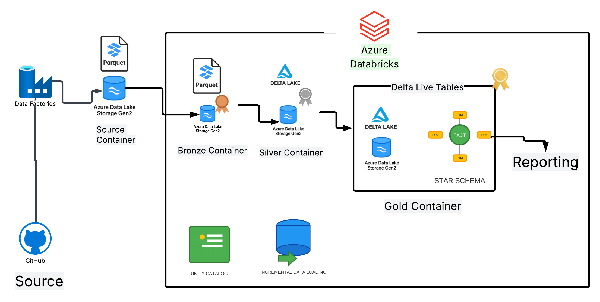

# Azure-Databricks-End-to-End-Project-Retail

# Project Overview:

Built an end to end retail data pipeline using Azure Data Factory, Databricks, and ADLS Gen2 with GitHub integration. Implemented Bronze–Silver–Gold architecture with PySpark transformations, SCD Type 1 & 2, and a Star Schema to deliver analytics-ready data models

# Project Architecture



# 📂 Project Structure

```
Azure-Databricks-End-to-End-Project-Retail/
│── README.md                      # Project documentation and overview
│── Retail_Project_Architecture.png # Architecture diagram of the pipeline
│
├── 📂 Azure_Databricks_Notebooks   # Databricks notebooks for each layer of the pipeline
│   ├── parameter_config.ipynb          # Defines datasets (orders, customers, products)
│   ├── Retail_Bronze_layer.ipynb       # Ingestion of raw data into Bronze layer
│   ├── Retail_Silver_Customers.ipynb   # Customer data cleaning & transformation
│   ├── Retail_Silver_Products.ipynb    # Product standardization & discount logic
│   ├── Retail_Silver_Orders.ipynb      # Order enrichment (ranking, date features)
│   ├── Retail_Silver_Regions.ipynb     # Regional data transformation
│   ├── Retail_Gold_Customers.ipynb     # Gold layer SCD Type 1 (Customers)
│   ├── Retail_Gold_Products.ipynb      # Gold layer SCD Type 2 (Products with DLT)
│   └── Retail_Gold_Orders.ipynb        # Fact Orders + Star Schema integration
│
├── 📂 Data                        # Sample retail CSV datasets
│   ├── customers-first.csv
│   ├── customers-second.csv
│   ├── orders-first.csv
│   ├── orders-second.csv
│   ├── products-first.csv
│   ├── products-second.csv
│   └── regions.csv
│
├── 📂 adf                         # Azure Data Factory configuration
│   ├── 📂 dataset                     # Dataset definitions (JSON)
│   ├── 📂 linkedService               # Linked service configurations (JSON)
│   └── 📂 pipeline                    # Pipeline workflows (JSON)
```


